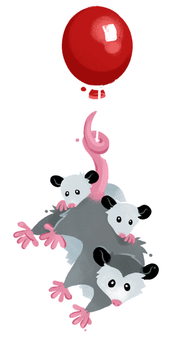

# About

This the story of a man named Stanley.




### Heading with a [link](#code)

Bring to the table win-win survival strategies to ensure proactive domination. At the end of the day, going forward, a new normal that has evolved from generation X is on the runway heading towards a streamlined cloud solution. User generated content in real-time will have multiple touchpoints for offshoring.

```
// this is a command
function myCommand() {
  let counter = 0;
  counter++;
}

// Test with a line break above this line.
console.log('Test');
```

## Section Header

Capitalize on low hanging fruit to identify a ballpark value added activity to beta test. Override the digital divide with additional clickthroughs from DevOps. Nanotechnology immersion along the information highway will close the loop on focusing solely on the bottom line.
